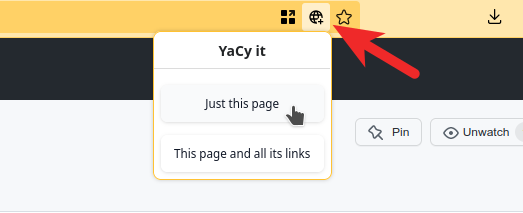

# THIS PROJECT IS ARCHIVED AS IT NO LONGER WORKS. KINDLY FORK AND FIDDLE WITH THE SOURCE IF YOU NEED TO.


## YACY it

Adds the current webpage to the local YACY index. This assumes you are running YaCy in `localhost:8090`.



## Getting the Extension

The extension is available from the [Firfox Addons site](https://addons.mozilla.org/en-US/firefox/addon/yacy-it/).

[](https://addons.mozilla.org/en-US/firefox/addon/yacy-it/)

## Configuring YaCy

The extension requires CORS headers to be set in order for it to display the messages correctly. This can be set by editing
`yacy/defaults/web.xml`. Add the following snippet after the `<description>` block and restart YaCy.

```xml
  <filter>
   <filter-name>cross-origin</filter-name>
   <filter-class>org.eclipse.jetty.servlets.CrossOriginFilter</filter-class>
   <init-param>
       <param-name>allowedOrigins</param-name>
       <param-value>*</param-value>
   </init-param>
   <init-param>
       <param-name>allowedMethods</param-name>
       <param-value>*</param-value>
   </init-param>
   <init-param>
       <param-name>allowedHeaders</param-name>
       <param-value>*</param-value>
   </init-param>
 </filter>
 <filter-mapping>
     <filter-name>cross-origin</filter-name>
     <url-pattern>/*</url-pattern>
 </filter-mapping>
```

**NOTE:** The extension also works without this configuration, but the right message will not be displayed after you click the button.


## Credits & Attribution

Icon - [Vitaly Gorbachev](https://www.flaticon.com/authors/vitaly-gorbachev) from Flaticon.com
